# TheLooker

### Code

## Yearly Revenue and Profit Trends

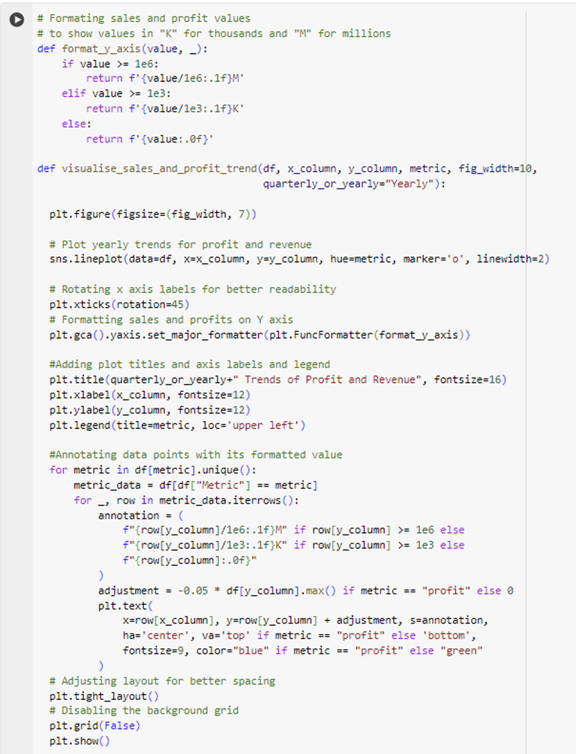
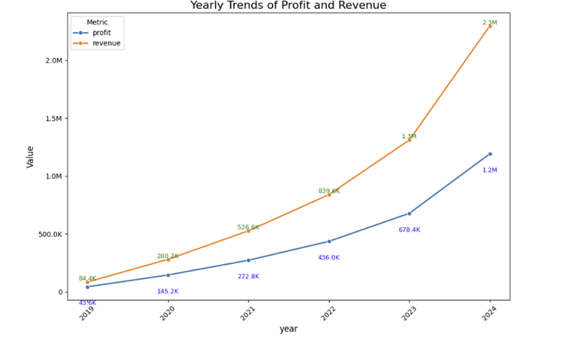

## Quarterly Revenue and Profit Trends
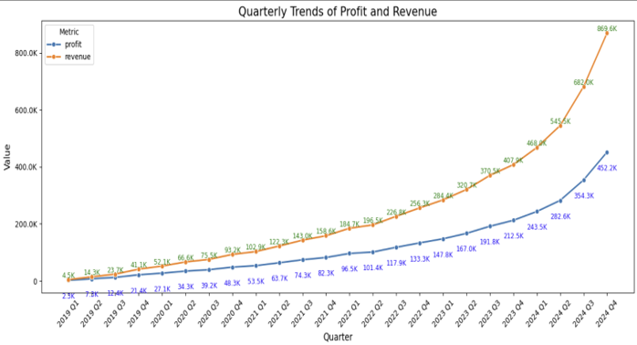

## Top 9 product distribution (2024)

### Region Distribution

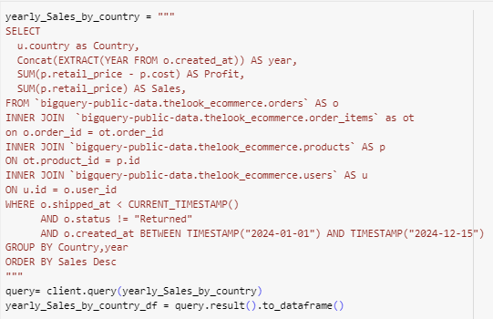
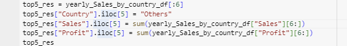

### Customer Acquisition
## Customer Acquisition Revenue Distribution and Average Order Value Pie charts (2024)

## Customer Acquisition Revenue Distribution and Average Order Value Pie charts (2019-2024)

## Traffic Sources Conversion Rate Growth(2019-2024)

## Different Traffic Sources Conversion Rates 2024

## Different Traffic Sources Conversion Rates (2019-2024)

## Customer Segemntation based on Customers’ Recency, Frequency and Monetary spend(RFM)
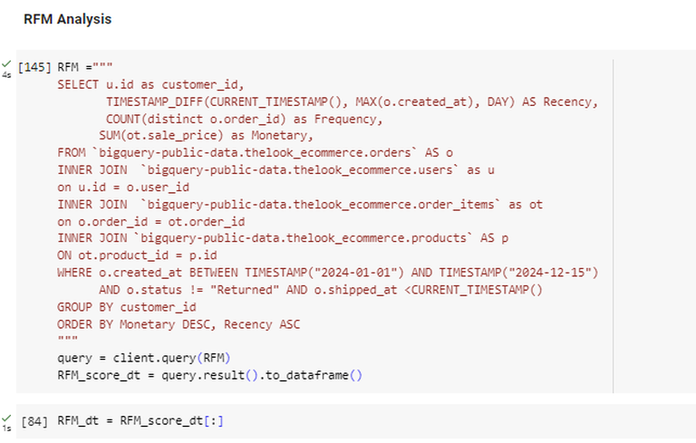

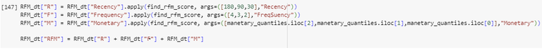
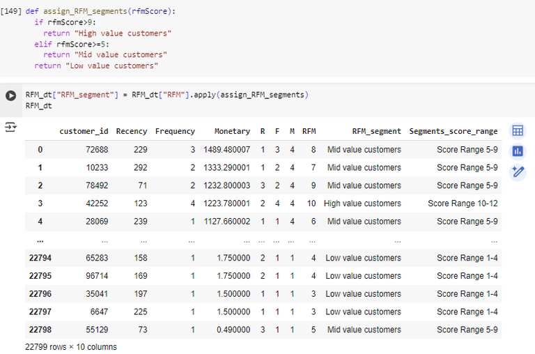
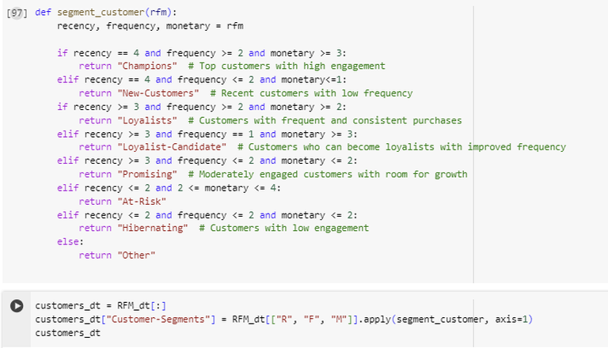
---------------------------------------------------------------------------------------------------
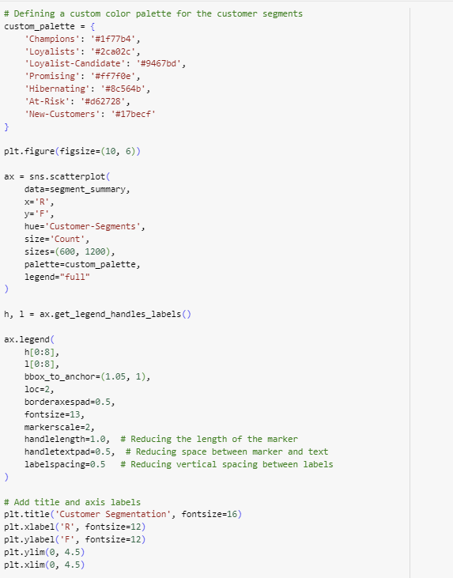
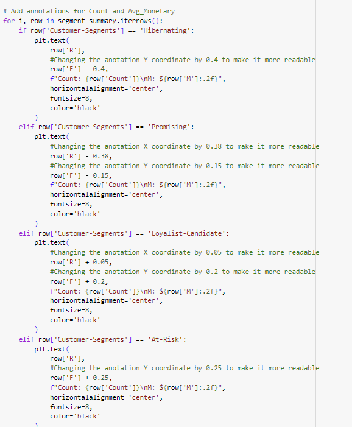
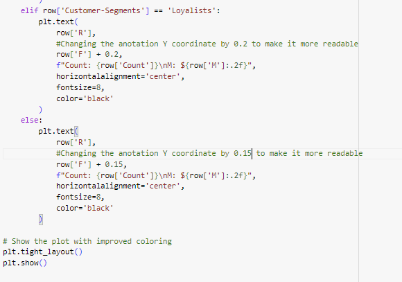
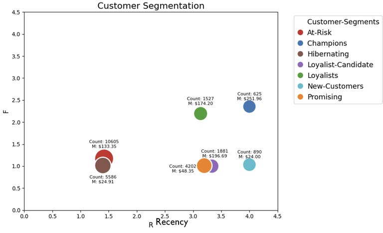
