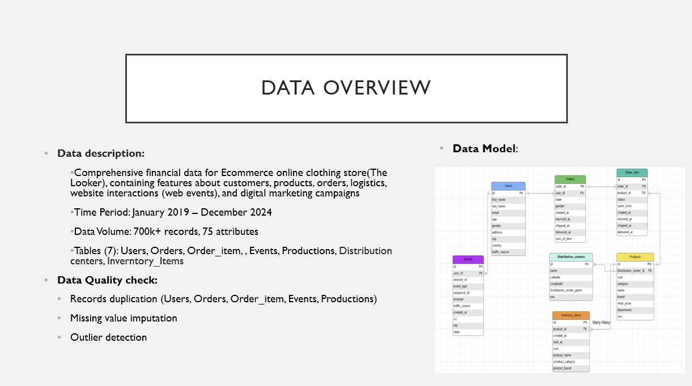
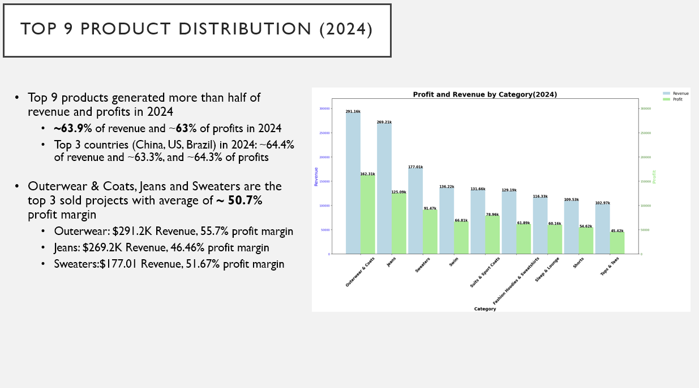
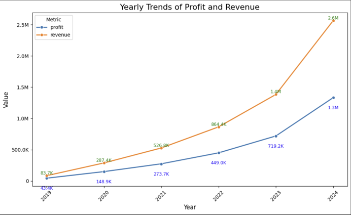
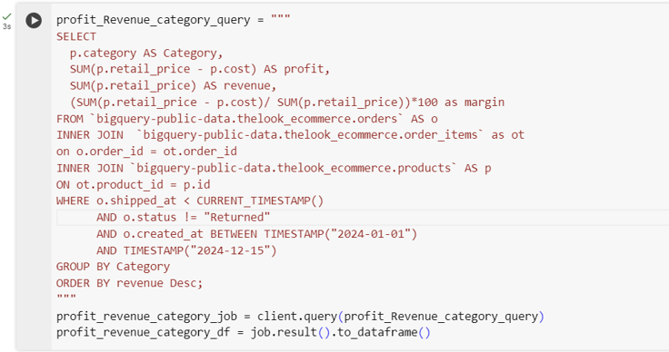
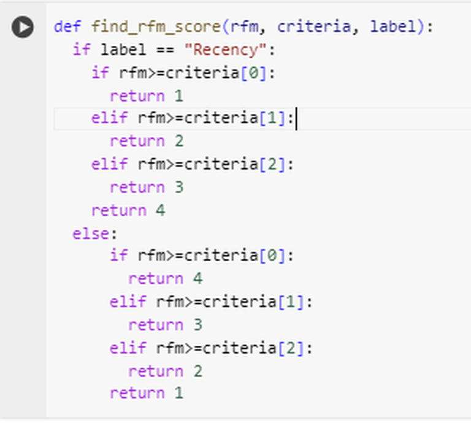

# TheLooker

### Code

## Yearly Revenue and Profit Trends

## Quarterly Revenue and Profit Trends

## Top 9 product distribution (2024)

### Region Distribution

### Customer Acquisition
## Customer Acquisition Revenue Distribution and Average Order Value Pie charts (2024)

## Customer Acquisition Revenue Distribution and Average Order Value Pie charts (2019-2024)

## Traffic Sources Conversion Rate Growth(2019-2024)

## Different Traffic Sources Conversion Rates 2024

## Different Traffic Sources Conversion Rates (2019-2024)

## Customer Segemntation based on Customers’ Recency, Frequency and Monetary spend(RFM)

---------------------------------------------------------------------------------------------------

