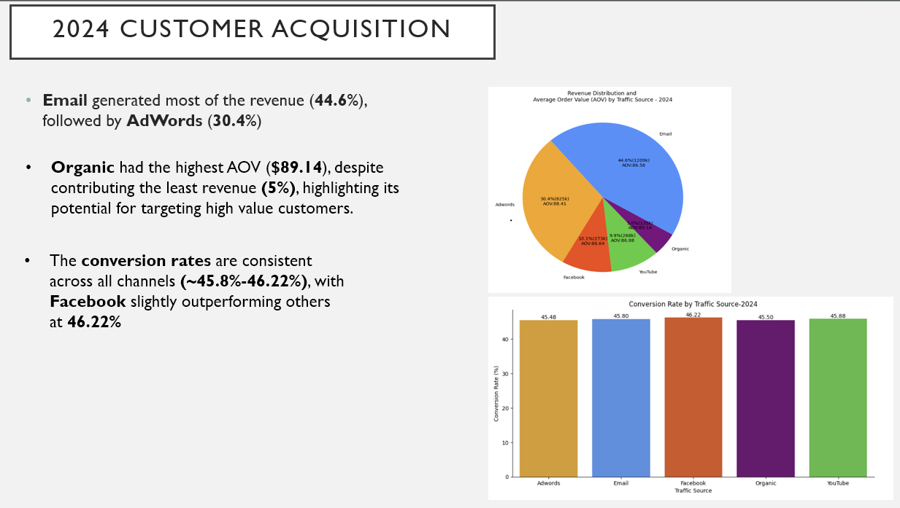

# TheLooker

### Code
## Top 9 product distribution (2024)

## Customer Acquisition Revenue Distribution and Average Order Value Pie charts (2024)

## Customer Acquisition Revenue Distribution and Average Order Value Pie charts (2019-2024)

